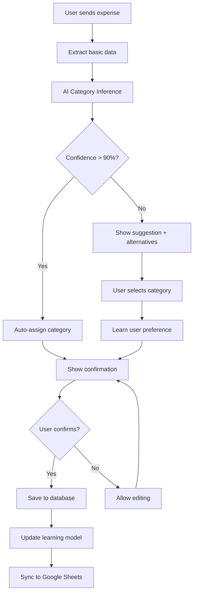

# PRD: ExpenseBot - Telegram Bot for Expense Tracking

## 1. Product Vision

**Mission:** Create a Telegram bot that enables natural and automatic expense recording using text, voice, or images, with automatic synchronization to Google Sheets for personal financial analysis.

**Vision:** Become the most intuitive personal financial assistant, eliminating the friction of manual expense tracking.

## 2. Project Objectives

### Primary Objectives:
- Automate expense recording through multiple input channels
- Reduce expense recording time from 2-3 minutes to 10-15 seconds
- Maintain real-time synchronization with Google Sheets
- Achieve 95% accuracy in data extraction
- **NEW:** Achieve 90%+ accuracy in automatic category inference

### Secondary Objectives:
- Generate basic expense insights
- Intelligent automatic categorization with learning capability
- Budget notifications
- Category-based spending analytics

## 3. Target Audience

**Primary User:** Carlos Cuamatzin (Senior Developer)
- Professional with stable income
- Needs detailed expense control
- Values automation and efficiency
- Comfortable with technology

## 4. Product Features

### 4.1 Core Features (MVP)

#### Expense Recording:
- **Direct text:** `$50 uber eats food`
- **Receipt image:** Upload → OCR → Extraction
- **Audio:** Recording → Speech-to-Text → Extraction
- **Interactive confirmation** before saving

#### Intelligent Processing:
- Automatic extraction of: amount, description, date, **category (AI-inferred)**
- Amount and format validation
- Multi-currency support (MXN by default)
- **NEW:** Smart category inference with confidence scoring

#### Storage:
- **PostgreSQL** as primary database
- **Google Sheets** as backup and analysis

### 4.2 Advanced Features (Post-MVP)

- Expense queries: `/expenses_today`, `/expenses_month`
- Enhanced automatic categorization with learning
- Budget alerts per category
- Report exports with category breakdown
- Simple web dashboard with category analytics
- **NEW:** Category spending trends and insights

## 5. Enhanced Category System

### 5.1 Predefined Categories Structure

```yaml
Categories:
  Food & Dining:
    - restaurants
    - fast_food
    - groceries
    - coffee_shops
    - delivery
    - alcohol

  Transportation:
    - public_transport
    - ride_sharing
    - fuel
    - parking
    - vehicle_maintenance
    - tolls

  Shopping:
    - clothing
    - electronics
    - home_goods
    - personal_care
    - gifts
    - online_shopping

  Entertainment:
    - movies
    - concerts
    - streaming_services
    - games
    - sports
    - hobbies

  Health & Wellness:
    - medical
    - pharmacy
    - fitness
    - dental
    - mental_health
    - supplements

  Bills & Utilities:
    - rent_mortgage
    - electricity
    - water
    - internet
    - phone
    - insurance

  Education:
    - courses
    - books
    - certifications
    - conferences
    - subscriptions

  Services:
    - professional_services
    - home_services
    - financial_services
    - subscription_services

  Travel:
    - flights
    - hotels
    - vacation_expenses
    - travel_insurance

  Other:
    - miscellaneous
    - uncategorized
```

### 5.2 AI Category Inference Logic

```yaml
Category Inference Strategy:
  1. Keyword Matching:
     - Primary keywords (direct match)
     - Secondary keywords (contextual)
     - Merchant name recognition

  2. Amount Pattern Recognition:
     - Typical price ranges per category
     - Frequency patterns

  3. Context Analysis:
     - Time of day/week patterns
     - Location context (if available)
     - Historical user patterns

  4. Confidence Scoring:
     - High (>90%): Auto-assign
     - Medium (70-90%): Suggest with option to change
     - Low (<70%): Require user confirmation
```

## 6. Technical Architecture (Updated)

### 6.1 Enhanced Eloquent Models

```php
// app/Models/Category.php (Enhanced)
class Category extends Model
{
    protected $fillable = [
        'name', 'slug', 'parent_id', 'color', 'icon',
        'keywords', 'is_active', 'sort_order'
    ];

    protected $casts = [
        'keywords' => 'array',
        'is_active' => 'boolean'
    ];

    public function parent()
    {
        return $this->belongsTo(Category::class, 'parent_id');
    }

    public function children()
    {
        return $this->hasMany(Category::class, 'parent_id');
    }

    public function expenses()
    {
        return $this->hasMany(Expense::class);
    }

    // Scope for getting only parent categories
    public function scopeParents($query)
    {
        return $query->whereNull('parent_id');
    }
}

// app/Models/Expense.php (Enhanced)
class Expense extends Model
{
    protected $fillable = [
        'user_id', 'amount', 'currency', 'description',
        'category_id', 'suggested_category_id', 'expense_date',
        'raw_input', 'confidence_score', 'category_confidence',
        'input_type', 'status', 'merchant_name'
    ];

    protected $casts = [
        'expense_date' => 'date',
        'amount' => 'decimal:2',
        'confidence_score' => 'float',
        'category_confidence' => 'float'
    ];

    public function user()
    {
        return $this->belongsTo(User::class);
    }

    public function category()
    {
        return $this->belongsTo(Category::class);
    }

    public function suggestedCategory()
    {
        return $this->belongsTo(Category::class, 'suggested_category_id');
    }
}

// NEW: app/Models/CategoryLearning.php
class CategoryLearning extends Model
{
    protected $fillable = [
        'user_id', 'keyword', 'category_id', 'confidence_weight',
        'usage_count', 'last_used_at'
    ];

    protected $casts = [
        'last_used_at' => 'datetime',
        'confidence_weight' => 'float'
    ];

    public function user()
    {
        return $this->belongsTo(User::class);
    }

    public function category()
    {
        return $this->belongsTo(Category::class);
    }
}
```

### 6.2 Enhanced Database Migrations

```php
// database/migrations/create_categories_table.php (Enhanced)
Schema::create('categories', function (Blueprint $table) {
    $table->id();
    $table->string('name');
    $table->string('slug')->unique();
    $table->foreignId('parent_id')->nullable()->constrained('categories');
    $table->string('color', 7)->nullable(); // hex color
    $table->string('icon', 20)->nullable();
    $table->json('keywords')->nullable(); // Keywords for AI inference
    $table->boolean('is_active')->default(true);
    $table->integer('sort_order')->default(0);
    $table->timestamps();

    $table->index(['parent_id', 'is_active']);
});

// database/migrations/update_expenses_table.php
Schema::table('expenses', function (Blueprint $table) {
    $table->foreignId('suggested_category_id')->nullable()->constrained('categories');
    $table->float('category_confidence')->nullable();
    $table->string('merchant_name')->nullable();

    $table->index(['category_id', 'expense_date']);
    $table->index('category_confidence');
});

// NEW: database/migrations/create_category_learning_table.php
Schema::create('category_learning', function (Blueprint $table) {
    $table->id();
    $table->foreignId('user_id')->constrained()->onDelete('cascade');
    $table->string('keyword');
    $table->foreignId('category_id')->constrained();
    $table->float('confidence_weight')->default(1.0);
    $table->integer('usage_count')->default(1);
    $table->timestamp('last_used_at');
    $table->timestamps();

    $table->unique(['user_id', 'keyword', 'category_id']);
    $table->index(['user_id', 'keyword']);
});
```

## 7. Enhanced AI Services

### 7.1 Category Inference Service

```php
// app/Services/CategoryInferenceService.php
class CategoryInferenceService
{
    private $openAIService;
    private $categoryLearningService;

    public function __construct(
        OpenAIService $openAIService,
        CategoryLearningService $categoryLearningService
    ) {
        $this->openAIService = $openAIService;
        $this->categoryLearningService = $categoryLearningService;
    }

    public function inferCategory(User $user, string $description, ?float $amount = null): array
    {
        // 1. Try user's historical patterns first
        $userPattern = $this->categoryLearningService->findBestMatch($user, $description);

        if ($userPattern && $userPattern['confidence'] >= 0.85) {
            return [
                'category_id' => $userPattern['category_id'],
                'confidence' => $userPattern['confidence'],
                'method' => 'user_learning'
            ];
        }

        // 2. Use keyword matching with predefined categories
        $keywordMatch = $this->matchByKeywords($description, $amount);

        if ($keywordMatch && $keywordMatch['confidence'] >= 0.75) {
            return $keywordMatch;
        }

        // 3. Use OpenAI for complex inference
        $aiInference = $this->openAIService->inferCategory($description, $amount);

        return [
            'category_id' => $aiInference['category_id'],
            'confidence' => $aiInference['confidence'],
            'method' => 'ai_inference'
        ];
    }

    private function matchByKeywords(string $description, ?float $amount = null): ?array
    {
        $description = strtolower($description);
        $bestMatch = null;
        $highestScore = 0;

        $categories = Category::with('parent')->where('is_active', true)->get();

        foreach ($categories as $category) {
            $score = 0;
            $keywords = $category->keywords ?? [];

            foreach ($keywords as $keyword) {
                if (str_contains($description, strtolower($keyword))) {
                    $score += strlen($keyword) / strlen($description);
                }
            }

            // Bonus for amount patterns
            if ($amount && $this->matchesAmountPattern($category, $amount)) {
                $score += 0.2;
            }

            if ($score > $highestScore) {
                $highestScore = $score;
                $bestMatch = [
                    'category_id' => $category->id,
                    'confidence' => min($score, 0.95),
                    'method' => 'keyword_matching'
                ];
            }
        }

        return $bestMatch;
    }

    private function matchesAmountPattern(Category $category, float $amount): bool
    {
        // Define typical amount ranges for categories
        $amountPatterns = [
            'coffee_shops' => ['min' => 30, 'max' => 150],
            'public_transport' => ['min' => 5, 'max' => 50],
            'groceries' => ['min' => 100, 'max' => 2000],
            'restaurants' => ['min' => 150, 'max' => 1500],
            // Add more patterns...
        ];

        $pattern = $amountPatterns[$category->slug] ?? null;

        if (!$pattern) return false;

        return $amount >= $pattern['min'] && $amount <= $pattern['max'];
    }
}

// app/Services/CategoryLearningService.php
class CategoryLearningService
{
    public function findBestMatch(User $user, string $description): ?array
    {
        $keywords = $this->extractKeywords($description);
        $matches = [];

        foreach ($keywords as $keyword) {
            $learning = CategoryLearning::where('user_id', $user->id)
                ->where('keyword', 'LIKE', "%{$keyword}%")
                ->orderByDesc('confidence_weight')
                ->first();

            if ($learning) {
                $matches[] = [
                    'category_id' => $learning->category_id,
                    'confidence' => $learning->confidence_weight,
                    'keyword' => $keyword
                ];
            }
        }

        if (empty($matches)) return null;

        // Return best match
        return collect($matches)->sortByDesc('confidence')->first();
    }

    public function learnFromUserChoice(User $user, string $description, int $categoryId): void
    {
        $keywords = $this->extractKeywords($description);

        foreach ($keywords as $keyword) {
            CategoryLearning::updateOrCreate(
                [
                    'user_id' => $user->id,
                    'keyword' => $keyword,
                    'category_id' => $categoryId
                ],
                [
                    'confidence_weight' => DB::raw('confidence_weight + 0.1'),
                    'usage_count' => DB::raw('usage_count + 1'),
                    'last_used_at' => now()
                ]
            );
        }
    }

    private function extractKeywords(string $description): array
    {
        // Simple keyword extraction - can be enhanced with NLP
        $words = explode(' ', strtolower($description));
        return array_filter($words, function($word) {
            return strlen($word) >= 3 && !in_array($word, ['the', 'and', 'for', 'con', 'por', 'del']);
        });
    }
}
```

### 7.2 Enhanced OpenAI Service

```php
// app/Services/OpenAIService.php (Enhanced)
class OpenAIService
{
    public function extractExpenseData(string $text): array
    {
        $categories = $this->getCategoryList();

        $prompt = "
        Extract expense information from the following text and return ONLY valid JSON:

        Text: {$text}

        Available categories: " . implode(', ', $categories) . "

        Expected format:
        {
            \"amount\": 123.45,
            \"description\": \"expense description\",
            \"category\": \"category_slug\",
            \"category_confidence\": 0.95,
            \"merchant_name\": \"merchant name if identifiable\",
            \"date\": \"YYYY-MM-DD\",
            \"confidence\": 0.95
        }

        Rules:
        - If no date, use current date
        - Choose the most appropriate category from the list
        - Extract merchant name if clearly identifiable
        - Amount must be numeric without currency symbols
        - category_confidence should reflect how certain you are about the category (0.0-1.0)
        ";

        $response = Http::withHeaders([
            'Authorization' => 'Bearer ' . config('services.openai.key'),
            'Content-Type' => 'application/json',
        ])->post('https://api.openai.com/v1/chat/completions', [
            'model' => 'gpt-3.5-turbo',
            'messages' => [
                ['role' => 'user', 'content' => $prompt]
            ],
            'max_tokens' => 250,
            'temperature' => 0.1
        ]);

        return json_decode($response->json()['choices'][0]['message']['content'], true);
    }

    public function inferCategory(string $description, ?float $amount = null): array
    {
        $categories = $this->getCategoryList();
        $amountContext = $amount ? " Amount: $amount MXN." : "";

        $prompt = "
        Analyze this expense description and infer the most appropriate category:

        Description: {$description}{$amountContext}

        Available categories: " . implode(', ', $categories) . "

        Return ONLY valid JSON:
        {
            \"category_slug\": \"most_appropriate_category\",
            \"confidence\": 0.95,
            \"reasoning\": \"brief explanation\"
        }

        Consider Mexican context and common spending patterns.
        ";

        $response = Http::withHeaders([
            'Authorization' => 'Bearer ' . config('services.openai.key'),
            'Content-Type' => 'application/json',
        ])->post('https://api.openai.com/v1/chat/completions', [
            'model' => 'gpt-3.5-turbo',
            'messages' => [
                ['role' => 'user', 'content' => $prompt]
            ],
            'max_tokens' => 150,
            'temperature' => 0.2
        ]);

        $result = json_decode($response->json()['choices'][0]['message']['content'], true);

        // Find category ID by slug
        $category = Category::where('slug', $result['category_slug'])->first();

        return [
            'category_id' => $category?->id,
            'confidence' => $result['confidence'] ?? 0.5,
            'reasoning' => $result['reasoning'] ?? ''
        ];
    }

    private function getCategoryList(): array
    {
        return Category::where('is_active', true)
            ->pluck('slug')
            ->toArray();
    }
}
```

## 8. Enhanced Processing Jobs

```php
// app/Jobs/ProcessExpenseText.php (Enhanced)
class ProcessExpenseText implements ShouldQueue
{
    use Dispatchable, InteractsWithQueue, Queueable, SerializesModels;

    protected $userId;
    protected $text;

    public function handle(
        OpenAIService $openAIService,
        CategoryInferenceService $categoryService,
        CategoryLearningService $learningService,
        TelegramService $telegramService
    ) {
        $user = User::where('telegram_id', $this->userId)->first();

        // 1. Extract basic expense data
        $expenseData = $openAIService->extractExpenseData($this->text);

        // 2. Infer category with multiple methods
        $categoryInference = $categoryService->inferCategory(
            $user,
            $expenseData['description'],
            $expenseData['amount']
        );

        // 3. Merge data
        $expenseData['category_id'] = $categoryInference['category_id'];
        $expenseData['category_confidence'] = $categoryInference['confidence'];
        $expenseData['inference_method'] = $categoryInference['method'];

        // 4. Send confirmation to user with category suggestion
        $telegramService->sendExpenseConfirmationWithCategory($this->userId, $expenseData);
    }
}
```

## 9. Enhanced Telegram Interactions

```php
// app/Services/TelegramService.php (Enhanced)
class TelegramService
{
    public function sendExpenseConfirmationWithCategory($chatId, $expenseData)
    {
        $category = Category::find($expenseData['category_id']);
        $confidence = round($expenseData['category_confidence'] * 100);

        $message = "💰 *Expense detected!*\n\n";
        $message .= "💵 *Amount:* $" . number_format($expenseData['amount'], 2) . " " . $expenseData['currency'] . "\n";
        $message .= "📝 *Description:* " . $expenseData['description'] . "\n";
        $message .= "📅 *Date:* " . $expenseData['date'] . "\n";
        $message .= "🏷️ *Category:* " . ($category->icon ?? '📋') . " " . $category->name;

        if ($expenseData['category_confidence'] < 0.9) {
            $message .= " *(Confidence: {$confidence}%)*";
        }

        if (isset($expenseData['merchant_name'])) {
            $message .= "\n🏪 *Merchant:* " . $expenseData['merchant_name'];
        }

        $message .= "\n\nIs this correct?";

        $keyboard = [
            [
                ['text' => '✅ Confirm', 'callback_data' => 'confirm_expense'],
                ['text' => '✏️ Edit Category', 'callback_data' => 'edit_category']
            ],
            [
                ['text' => '📝 Edit Description', 'callback_data' => 'edit_description'],
                ['text' => '❌ Cancel', 'callback_data' => 'cancel_expense']
            ]
        ];

        $this->sendMessage($chatId, $message, [
            'parse_mode' => 'Markdown',
            'reply_markup' => json_encode(['inline_keyboard' => $keyboard])
        ]);
    }

    public function sendCategorySelection($chatId, $currentCategoryId = null)
    {
        $categories = Category::parents()->where('is_active', true)->get();
        $keyboard = [];

        foreach ($categories->chunk(2) as $chunk) {
            $row = [];
            foreach ($chunk as $category) {
                $icon = $category->icon ?? '📋';
                $text = $icon . ' ' . $category->name;

                if ($category->id == $currentCategoryId) {
                    $text = '✅ ' . $text;
                }

                $row[] = [
                    'text' => $text,
                    'callback_data' => 'select_category_' . $category->id
                ];
            }
            $keyboard[] = $row;
        }

        // Add subcategory option if parent selected
        if ($currentCategoryId) {
            $keyboard[] = [
                ['text' => '🔍 View Subcategories', 'callback_data' => 'show_subcategories_' . $currentCategoryId],
                ['text' => '↩️ Back', 'callback_data' => 'back_to_expense']
            ];
        }

        $this->sendMessage($chatId, "🏷️ *Select a category:*", [
            'parse_mode' => 'Markdown',
            'reply_markup' => json_encode(['inline_keyboard' => $keyboard])
        ]);
    }
}
```

## 10. Category Seeder

```php
// database/seeders/CategorySeeder.php
class CategorySeeder extends Seeder
{
    public function run()
    {
        $categories = [
            [
                'name' => 'Food & Dining',
                'slug' => 'food_dining',
                'icon' => '🍽️',
                'color' => '#FF6B6B',
                'keywords' => ['comida', 'restaurante', 'food', 'dinner', 'lunch', 'breakfast'],
                'children' => [
                    ['name' => 'Restaurants', 'slug' => 'restaurants', 'icon' => '🍽️', 'keywords' => ['restaurante', 'restaurant', 'cena', 'dinner']],
                    ['name' => 'Fast Food', 'slug' => 'fast_food', 'icon' => '🍔', 'keywords' => ['mcdonalds', 'burger', 'pizza', 'kfc', 'subway']],
                    ['name' => 'Groceries', 'slug' => 'groceries', 'icon' => '🛒', 'keywords' => ['soriana', 'walmart', 'supermarket', 'groceries', 'supermercado']],
                    ['name' => 'Coffee Shops', 'slug' => 'coffee_shops', 'icon' => '☕', 'keywords' => ['starbucks', 'cafe', 'coffee', 'café']],
                    ['name' => 'Delivery', 'slug' => 'delivery', 'icon' => '🚚', 'keywords' => ['uber eats', 'rappi', 'didi food', 'delivery']],
                ]
            ],
            [
                'name' => 'Transportation',
                'slug' => 'transportation',
                'icon' => '🚗',
                'color' => '#4ECDC4',
                'keywords' => ['transport', 'transporte', 'taxi', 'uber', 'metro'],
                'children' => [
                    ['name' => 'Public Transport', 'slug' => 'public_transport', 'icon' => '🚌', 'keywords' => ['metro', 'bus', 'metrobus', 'public transport']],
                    ['name' => 'Ride Sharing', 'slug' => 'ride_sharing', 'icon' => '🚕', 'keywords' => ['uber', 'didi', 'taxi', 'ride']],
                    ['name' => 'Fuel', 'slug' => 'fuel', 'icon' => '⛽', 'keywords' => ['gasolina', 'gas', 'fuel', 'pemex', 'shell']],
                    ['name' => 'Parking', 'slug' => 'parking', 'icon' => '🅿️', 'keywords' => ['parking', 'estacionamiento', 'valet']],
                ]
            ],
            [
                'name' => 'Shopping',
                'slug' => 'shopping',
                'icon' => '🛍️',
                'color' => '#45B7D1',
                'keywords' => ['shopping', 'compras', 'tienda', 'store'],
                'children' => [
                    ['name' => 'Clothing', 'slug' => 'clothing', 'icon' => '👕', 'keywords' => ['ropa', 'clothing', 'zara', 'h&m', 'nike']],
                    ['name' => 'Electronics', 'slug' => 'electronics', 'icon' => '📱', 'keywords' => ['electronics', 'phone', 'computer', 'laptop', 'apple']],
                    ['name' => 'Personal Care', 'slug' => 'personal_care', 'icon' => '🧴', 'keywords' => ['pharmacy', 'farmacia', 'shampoo', 'soap']],
                ]
            ],
            [
                'name' => 'Entertainment',
                'slug' => 'entertainment',
                'icon' => '🎬',
                'color' => '#96CEB4',
                'keywords' => ['entertainment', 'entretenimiento', 'movie', 'cinema'],
                'children' => [
                    ['name' => 'Movies', 'slug' => 'movies', 'icon' => '🎥', 'keywords' => ['cinema', 'cine', 'movie', 'cinemex', 'cinepolis']],
                    ['name' => 'Streaming', 'slug' => 'streaming', 'icon' => '📺', 'keywords' => ['netflix', 'spotify', 'amazon prime', 'disney plus']],
                ]
            ],
            [
                'name' => 'Health & Wellness',
                'slug' => 'health_wellness',
                'icon' => '🏥',
                'color' => '#FFEAA7',
                'keywords' => ['health', 'salud', 'doctor', 'medical'],
                'children' => [
                    ['name' => 'Medical', 'slug' => 'medical', 'icon' => '⚕️', 'keywords' => ['doctor', 'medico', 'hospital', 'clinic']],
                    ['name' => 'Pharmacy', 'slug' => 'pharmacy', 'icon' => '💊', 'keywords' => ['farmacia', 'pharmacy', 'medicine', 'medicina']],
                    ['name' => 'Fitness', 'slug' => 'fitness', 'icon' => '💪', 'keywords' => ['gym', 'gimnasio', 'fitness', 'sports club']],
                ]
            ],
            [
                'name' => 'Bills & Utilities',
                'slug' => 'bills_utilities',
                'icon' => '📄',
                'color' => '#DDA0DD',
                'keywords' => ['bill', 'recibo', 'utility', 'servicio'],
                'children' => [
                    ['name' => 'Electricity', 'slug' => 'electricity', 'icon' => '⚡', 'keywords' => ['cfe', 'electricity', 'luz', 'electric']],
                    ['name' => 'Internet', 'slug' => 'internet', 'icon' => '🌐', 'keywords' => ['internet', 'wifi', 'telmex', 'izzi', 'totalplay']],
                    ['name' => 'Phone', 'slug' => 'phone', 'icon' => '📞', 'keywords' => ['phone', 'telefono', 'telcel', 'movistar', 'at&t']],
                ]
            ]
        ];

        foreach ($categories as $categoryData) {
            $children = $categoryData['children'] ?? [];
            unset($categoryData['children']);

            $parent = Category::create($categoryData);

            foreach ($children as $childData) {
                $childData['parent_id'] = $parent->id;
                $childData['color'] = $parent->color;
                Category::create($childData);
            }
        }
    }
}
```

## 11. Enhanced User Flow



## 12. Analytics & Insights Features

### 12.1 Category Analytics Commands

```php
// New Telegram commands for category insights
/category_spending - Show spending by category this month
/top_categories - Show top 5 spending categories
/category_trends - Show category spending trends
/set_budget [category] [amount] - Set budget for category
```

### 12.2 Google Sheets Enhanced Structure

```javascript
// Enhanced Google Sheet with category analytics
const SHEET_STRUCTURE = {
    'Expenses': ['Date', 'Amount', 'Currency', 'Description', 'Category', 'Subcategory', 'Method', 'Confidence', 'ID'],
    'Category Summary': ['Category', 'This Month', 'Last Month', 'Change %', 'Budget', 'Remaining'],
    'Monthly Trends': ['Month', 'Food', 'Transport', 'Shopping', 'Entertainment', 'Health', 'Bills', 'Other'],
    'Settings': ['Setting', 'Value', 'Last Updated']
};
```

## 13. Success Metrics (Updated)

### Technical Metrics:
- **Response time:** < 3 seconds for processing
- **OCR accuracy:** > 90% on readable receipts
- **Speech-to-Text accuracy:** > 95% in Spanish
- **Category inference accuracy:** > 90%
- **User category acceptance rate:** > 85%
- **Uptime:** > 99.5%

### User Metrics:
- **Adoption:** Consistent daily use for 30 days
- **Category satisfaction:** > 90% acceptance of AI suggestions
- **Learning improvement:** Category accuracy increases over time
- **Efficiency:** Registration time reduction > 80%

## 14. Estimated Budget (Updated)

```
Hosting (DigitalOcean): $25-50
OpenAI GPT-3.5-turbo: $10-25 (increased for category inference)
Google Cloud Vision: $10-20
Google Speech-to-Text: $5-15
Redis (managed): $15-25
PostgreSQL (managed): $20-30
TOTAL: ~$85-165 USD/month
```
